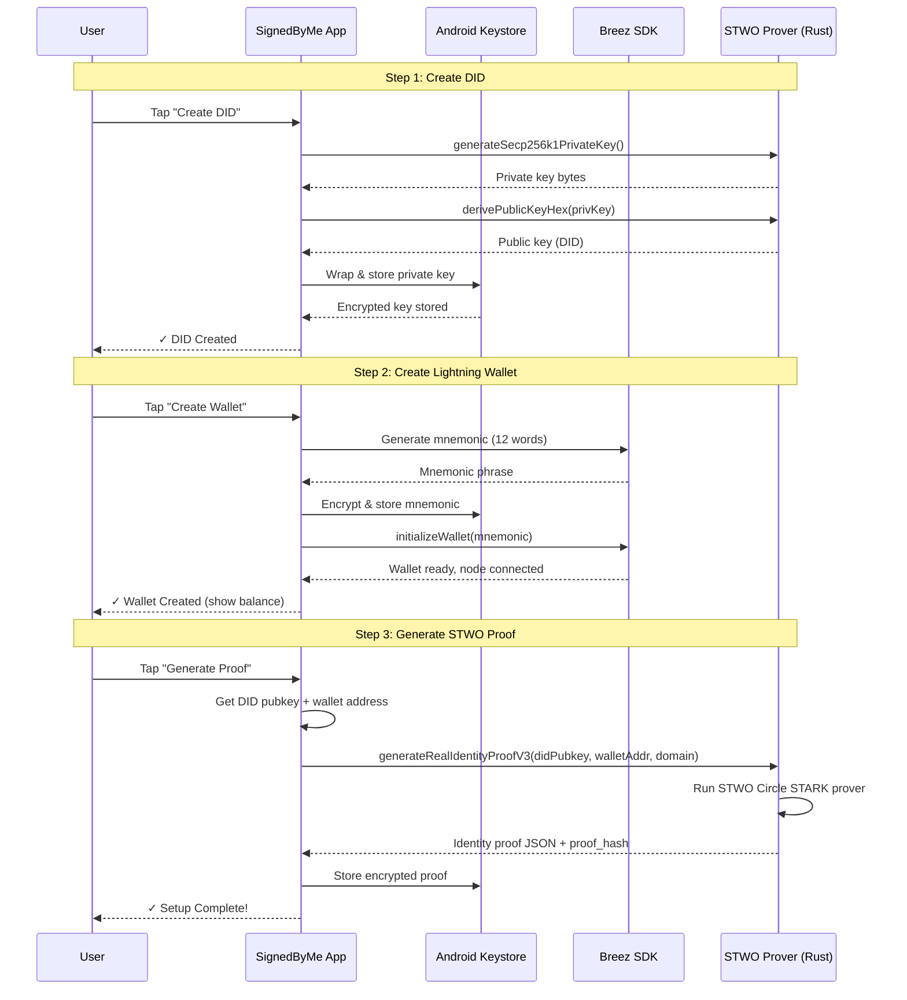
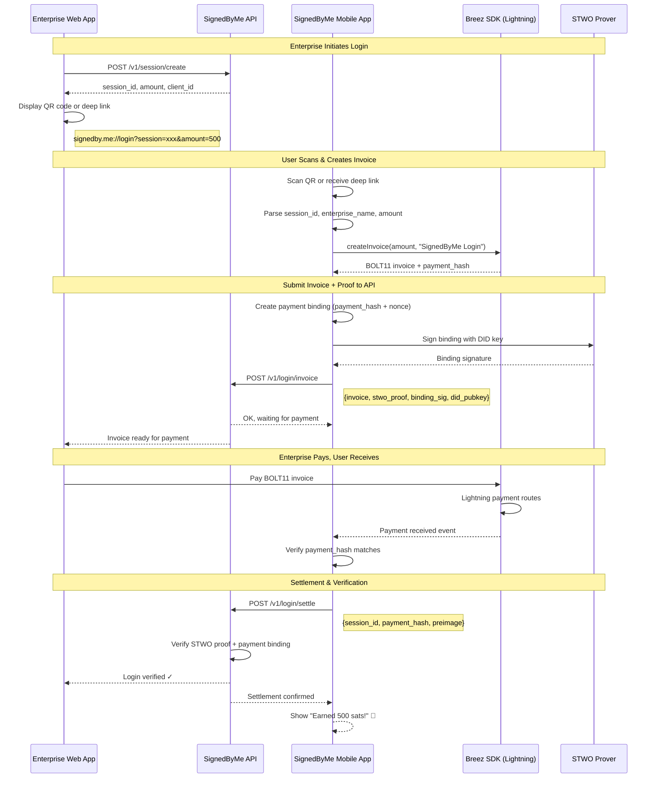
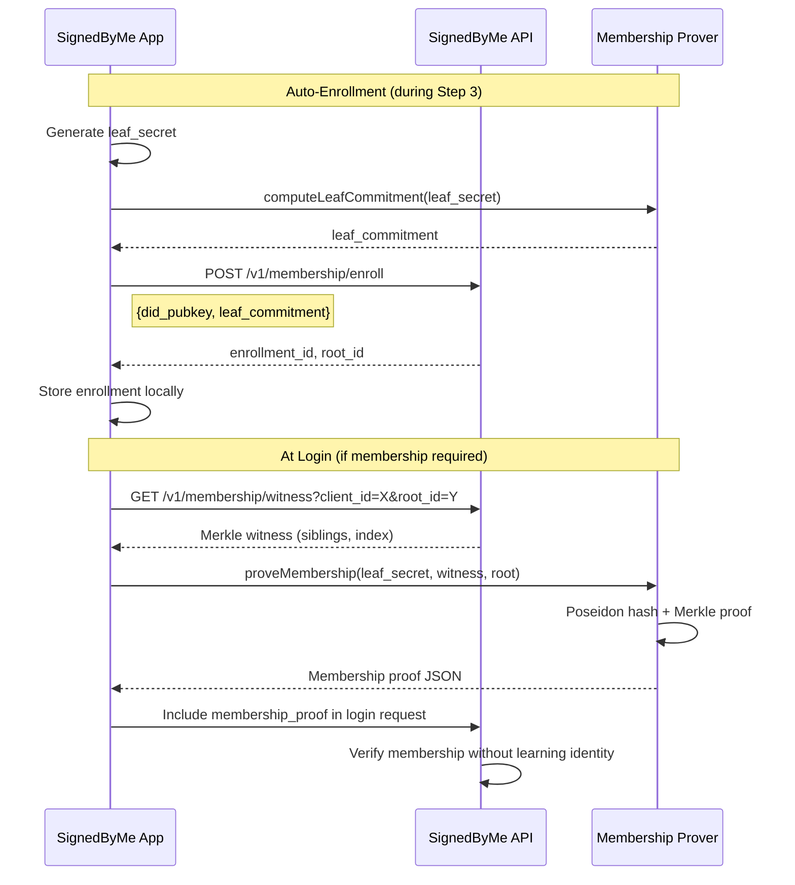

# SignedByMe

**Get Paid to Log In** — Bitcoin-based identity verification where users earn sats for authentication.

## How It Works

1. User sets up DID + Lightning wallet in the app (one-time onboarding)
2. User generates STWO proof binding their DID ↔ Wallet
3. Enterprise shows "Sign in with SignedByMe" QR or deep link
4. User scans → app creates Lightning invoice
5. Enterprise pays invoice → sats go to user's wallet
6. STWO proof + payment binding sent to API → User verified AND got paid

## Architecture

```
┌─────────────────┐     ┌─────────────────┐     ┌─────────────────┐
│  Enterprise     │     │  SignedByMe     │     │  User's         │
│  Web App        │────▶│  API            │◀────│  Mobile App     │
└─────────────────┘     └─────────────────┘     └─────────────────┘
                                                        │
                                                        ▼
                                                ┌─────────────────┐
                                                │  Lightning      │
                                                │  Network        │
                                                └─────────────────┘
```

---

## Flow Diagrams

### Onboarding Flow (One-Time Setup)



### Login Flow (Get Paid to Verify)



### Membership Proof Flow (Optional)



---

## Cryptographic Chain

```
DID Private Key ──sign──▶ Identity Proof (STWO)
        │                         │
        │                         ▼
        │                   proof_hash
        │                         │
        ▼                         ▼
Payment Binding ◀────────── binding_hash
        │
        ├── payment_hash (from invoice)
        ├── nonce (from API)
        └── signature (DID signs binding)

At verification:
✓ STWO proof is valid (DID owns wallet)
✓ Binding signature matches DID
✓ Payment hash matches paid invoice
✓ Nonce prevents replay
```

---

## Project Structure

```
btc-did/
├── app/                          # Android app (Kotlin)
│   └── src/main/java/.../
│       ├── MainActivity.kt       # Main UI (4,600 lines)
│       ├── SplashActivity.kt     # Animated cursive S splash
│       ├── DidWalletManager.kt   # DID + proof management
│       ├── BreezWalletManager.kt # Lightning wallet
│       ├── NativeBridge.kt       # Rust JNI bindings
│       └── BackupStateManager.kt # Backup prompts
├── native/btcdid_core/           # Rust library
│   └── src/
│       ├── lib.rs                # JNI exports
│       ├── stwo_*.rs             # STWO prover
│       └── membership.rs         # Merkle proofs
├── api/                          # FastAPI backend
│   └── app/
│       ├── main.py
│       └── routes/
│           ├── login_invoice.py
│           └── membership.py
└── docs/
```

---

## URLs

- **Deep Link:** `signedby.me://login?session=xxx&amount=500`
- **API Base:** `https://api.beta.privacy-lion.com`
- **Demo Site:** `https://beta.privacy-lion.com`

---

## Tech Stack

| Component | Technology |
|-----------|------------|
| Mobile App | Kotlin + Jetpack Compose |
| Lightning | Breez SDK |
| ZK Proofs | STWO (Circle STARKs) |
| Native Crypto | Rust + secp256k1 |
| API | FastAPI (Python) |
| Membership | Poseidon hash + Merkle trees |

---

## Status

- ✅ Android app complete
- ✅ Real STWO proofs (~1ms on device)
- ✅ Merkle membership proofs
- ✅ API deployed
- ⏳ iOS version (in progress)

---

*Built by [Privacy Lion](https://privacy-lion.com)*
